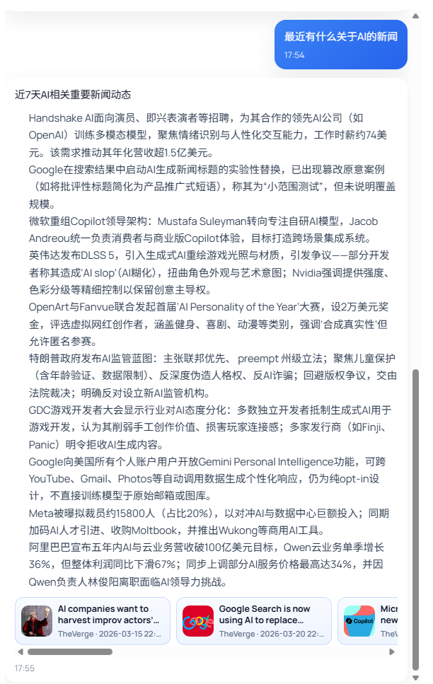

# 新闻聚合平台

一个基于 Java 21 的多模块新闻聚合与智能问答系统，支持新闻抓取、检索、向量召回、LLM 编排、Agent 执行、定时任务调度与网关统一接入。

## 项目特点

- 基于 RSS 的新闻抓取与入库
- 基于 Elasticsearch 的关键词检索
- 基于 Qdrant 的向量检索
- 基于 Spring AI Alibaba 的大模型编排
- 基于 Agent 的任务执行、回放与会话管理
- 基于 Dubbo + Nacos 的服务注册与发现
- 基于 XXL-Job 的定时任务调度


## 技术栈

- Java 21
- Spring Boot 3.5.9
- Spring Cloud Gateway
- Apache Dubbo 3.3.5
- Nacos 3.1.1
- MySQL 8
- Redis 8.4
- Elasticsearch8.19.9
- Qdrant v1.1.5
- MinIO RELEASE.2024-10-02T17-50-41Z-cpuv1
- XXL-Job 3.3.0
- Spring AI Alibaba 


## TO-DO-LIST


- [ ] 接入支付解锁限额
- [ ] 多会话切换
- [ ] SSE调用
- [ ] 生成小红书文案
- [ ] 文生图
- [ ] 文生视频
## 项目结构

```text
News_Aggregation
├─ news-aggregation-common
│  ├─ news-aggregation-base
│  ├─ news-aggregation-cache
│  ├─ news-aggregation-datasource
│  ├─ news-aggregation-es
│  ├─ news-aggregation-job
│  ├─ news-aggregation-rpc-contract
│  └─ news-aggregation-storage
├─ news-aggregation-business
│  ├─ news-aggregation-app
│  └─ news-aggregation-news
├─ news-aggregation-llm
│  └─ llm-spring-ai
├─ news-aggregation-agent
├─ news-aggregation-vector
├─ news-aggregation-embedding
├─ news-aggregation-web
├─ news-aggregation-gateway
└─ deploy
```

## 核心服务

### `news-aggregation-app`

- 端口：`8092`
- 主要业务服务
- 提供新闻抓取、新闻查询、定时任务、业务接口
- 对外提供 Dubbo 检索与查询能力

### `llm-spring-ai`

- 端口：`8081`
- 大模型服务
- 提供 planner、generator、router 等 LLM 能力
- 对外提供 Dubbo 的 LLM RPC 服务

### `news-aggregation-agent`

- 端口：`8084`
- Agent 执行服务
- 负责执行计划、检索编排、回放、会话与持久化能力

### `news-aggregation-gateway`

- 端口：`8091`
- 统一 API 网关
- 负责转发 `/api/news/**`、`/api/agent/**`、`/api/execution/**` 等请求

## 中间件依赖

项目依赖以下中间件：

- MySQL
- Redis
- Nacos
- Elasticsearch
- Qdrant
- MinIO
- XXL-Job Admin

仓库中已经提供部署目录：

- [deploy]

## 环境变量

请先复制 `.env.example` 为 `.env`：

```bash
cp .env.example .env
```

重点变量包括：

- `MYSQL_URL`
- `MYSQL_USERNAME`
- `MYSQL_PASSWORD`
- `REDIS_HOST`
- `REDIS_PASSWORD`
- `NACOS_ADDR`
- `QDRANT_HOST`
- `ES_HOST`
- `MINIO_ENDPOINT`
- `XXL_JOB_ADMIN_ADDRESSES`
- `XXL_JOB_ACCESS_TOKEN`
- `DASHSCOPE_API_KEY`
- `ZHIPU_API_KEY`
- `DUBBO_IP_TO_BIND`
- `DUBBO_IP_TO_REGISTRY`

## 本地构建

执行聚合构建：

```bash
mvn clean package "-Dmaven.test.skip=true"
```


## 本地启动

准备好 `.env` 后，建议按以下顺序启动：

1. `llm-spring-ai`
2. `news-aggregation-app`
3. `news-aggregation-agent`
4. `news-aggregation-gateway`

示例：

```bash
java -jar news-aggregation-llm/llm-spring-ai/target/llm-spring-ai-0.0.1-SNAPSHOT-exec.jar
java -jar news-aggregation-business/news-aggregation-app/target/news-aggregation-app-0.0.1-SNAPSHOT.jar
java -jar news-aggregation-agent/target/news-aggregation-agent-0.0.1-SNAPSHOT.jar
java -jar news-aggregation-gateway/target/news-aggregation-gateway-0.0.1-SNAPSHOT.jar
```

## 服务器部署

### 1. 启动中间件

优先使用 `deploy` 目录中的 Docker Compose 文件启动中间件。

### 2. 上传部署文件

至少上传以下内容：

- `.env`
- `llm-spring-ai-0.0.1-SNAPSHOT-exec.jar`
- `news-aggregation-app-0.0.1-SNAPSHOT.jar`
- `news-aggregation-agent-0.0.1-SNAPSHOT.jar`
- `news-aggregation-gateway-0.0.1-SNAPSHOT.jar`

### 3. 启动业务服务

```bash
cd /opt/news-aggregation
nohup java -jar llm-spring-ai-0.0.1-SNAPSHOT-exec.jar > logs/llm.log 2>&1 &
nohup java -jar news-aggregation-app-0.0.1-SNAPSHOT.jar > logs/app.log 2>&1 &
nohup java -jar news-aggregation-agent-0.0.1-SNAPSHOT.jar > logs/agent.log 2>&1 &
nohup java -jar news-aggregation-gateway-0.0.1-SNAPSHOT.jar > logs/gateway.log 2>&1 &
```

## 运行检查

查看 Java 进程：

```bash
ps -ef | grep java
```

查看监听端口：

```bash
ss -lntp | grep -E '8081|8084|8091|8092|9999|20880|20881'
```

查看运行日志：

```bash
tail -f /opt/news-aggregation/logs/llm.log
tail -f /opt/news-aggregation/logs/app.log
tail -f /opt/news-aggregation/logs/agent.log
tail -f /opt/news-aggregation/logs/gateway.log
```


